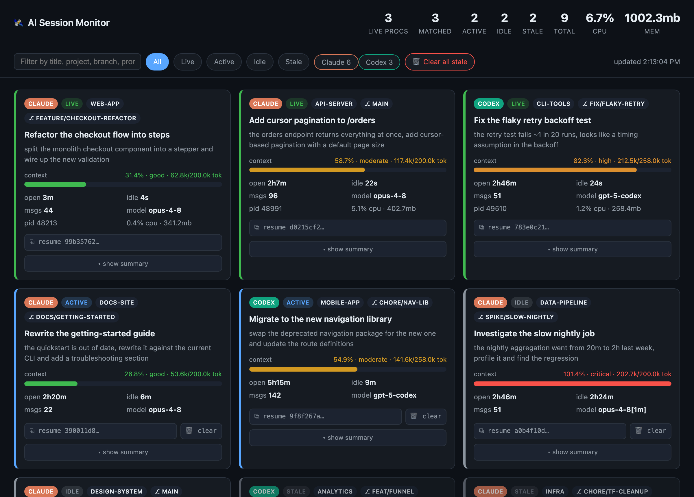
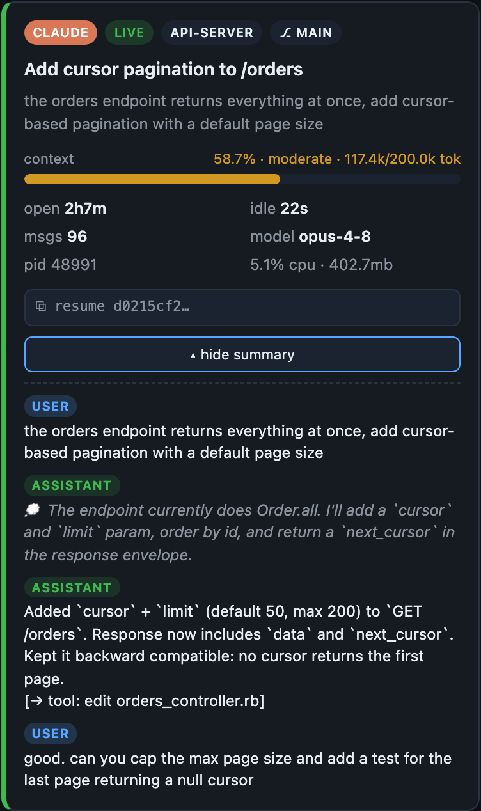

# AI Session Monitor

A local, **zero-dependency** dashboard for your AI coding-agent sessions on this
machine. Works across agents — **Claude Code** and **Codex** today, extensible to
more. See how many are live, each session's context rating, how long it's been
open, whether it's gone stale, what it's about, and the CPU/memory of the live
processes.



> The screenshots use synthetic demo data.

## Supported agents

| Agent | Sessions read from | Live process | Context window |
|-------|--------------------|--------------|----------------|
| **Claude Code** | `~/.claude/projects/**/*.jsonl` | `claude` | assumed 200k (override with `--window`) |
| **Codex** | `~/.codex/sessions/**/rollout-*.jsonl` | `codex` | read from the transcript (`model_context_window`) |

Adding another agent is a single entry in the `AGENTS` dict plus a parser
function — see `monitor.py`.

## What it shows

Read straight from each agent's transcripts plus `ps`:

| Field | Meaning |
|-------|---------|
| **Agent badge** | which tool the session belongs to (Claude / Codex) |
| **Live count** | number of running agent CLI processes |
| **State** | `live` / `active` (<10m) / `idle` (<24h) / `stale` |
| **Context rating** | current context tokens vs the session's window → good / moderate / high / critical |
| **Open / idle time** | first vs last transcript timestamp |
| **Title & last prompt** | the session's title and most recent prompt |
| **Project / branch** | `cwd` basename and git branch (Claude) |
| **CPU / MEM / PID** | from `ps`, matched to a session by nearest start time |

A live PID is linked to a session by matching process start time to session start
time within the same agent (agents don't hold their transcript files open and
sessions share a `cwd`, so this is the reliable signal). CLI-only: agent sessions
launched from an IDE/desktop app have no CLI process, so they show as idle/stale.

## Concepts

Two independent axes describe every session. **State** tells you whether a session
is running and how recently it was touched (should you close it?); **context
rating** tells you how full its context window is (is it running out of room?). A
session can be `live` and `critical` at once, or `stale` and `good` — the two
answer different questions.

### State — is it alive, and how recently was it touched?

State is decided in two steps: first "is a process actually running for it?", then
"how long since the transcript's last message?" (`age = now − last activity`).

| State | Rule | Meaning | Why the cutoff |
|-------|------|---------|----------------|
| **live** | a running agent PID is matched to it | Open right now in a terminal, process attached | Ground truth — a real process is using CPU/mem, not inferred from file age |
| **active** | not live, last activity ≤ **10 min** | Just worked in; you likely detached or it's between turns | Short enough that it's almost certainly a session you're still "in" |
| **idle** | not live, **10 min–24 h** | Paused today but not abandoned; likely to be resumed | Covers "stepped away" without flagging it for cleanup |
| **stale** | not live, last activity > **24 h** | Untouched over a day — the forgotten/abandoned pile | The "closed the terminal and never cleared it" sessions; this is what `--clean` and **Clear all stale** target |

**Stale = a non-running session whose last activity was more than 24 hours ago.**
Clearing it is recoverable (archived, not deleted), and live/idle sessions,
memories, and code are left untouched. The two thresholds are `ACTIVE_SECS`
(active→idle, 10 min) and `IDLE_SECS` (idle→stale, 24 h) in `monitor.py`.

### Context rating — how full is the window?

`percent = context tokens / window`. Window is read from the session when it
declares one (Codex), else falls back to 200k (`--window` to override).

| Rating | Threshold | Why |
|--------|-----------|-----|
| **good** | < 50% | Plenty of headroom |
| **moderate** | 50–75% | Filling up; worth being aware |
| **high** | 75–90% | Getting tight — good time to wrap up or `/clear` soon |
| **critical** | ≥ 90% | About to hit the wall; summarization/context loss is imminent |

## Run it

```bash
python3 monitor.py                 # dashboard at http://127.0.0.1:8787
./ai-monitor                        # same, and opens your browser
python3 monitor.py --port 9000     # custom port
python3 monitor.py --once          # one-shot text summary in the terminal
python3 monitor.py --json          # raw JSON snapshot (pipe into jq, etc.)
```

Requires only Python 3 (the one macOS ships works). Auto-refreshes every 5s.

## Conversation summary

Every card has a **`▾ show summary`** toggle that fetches the last ~6 turns of that
conversation on demand and shows them inline: user prompts, assistant replies
(thinking dimmed, tool calls summarized). Open panels persist across refreshes.



## Resuming & clearing sessions

- **Resume:** each card's `⧉ resume` button copies the right command for that agent
  (`claude --resume <id>` or `codex resume <id>`, prefixed with `cd <cwd>`).
- **Clear (archive):** idle/stale cards have `🗑 clear`, and there's a **Clear all
  stale** button. Clearing *moves* the transcript to the agent's
  `…-archive/` folder (recoverable), it does **not** hard-delete.

Guardrails: clearing only touches `*.jsonl` transcripts under a known agent
session root, refuses anything in a `memory`/`memories` folder, and refuses a live
session.

Bulk cleanup from the CLI (dry-run by default):

```bash
python3 monitor.py --clean --days 30           # dry-run: list stale sessions >30d
python3 monitor.py --clean --days 30 --yes      # archive them
python3 monitor.py --clean --days 30 --yes --purge   # permanent delete instead
```

## Sharing it

Single file, no dependencies — hand someone `monitor.py` (or this folder) and they
run the same command. It only reads local files and binds to `127.0.0.1`, so
nothing leaves the machine.
